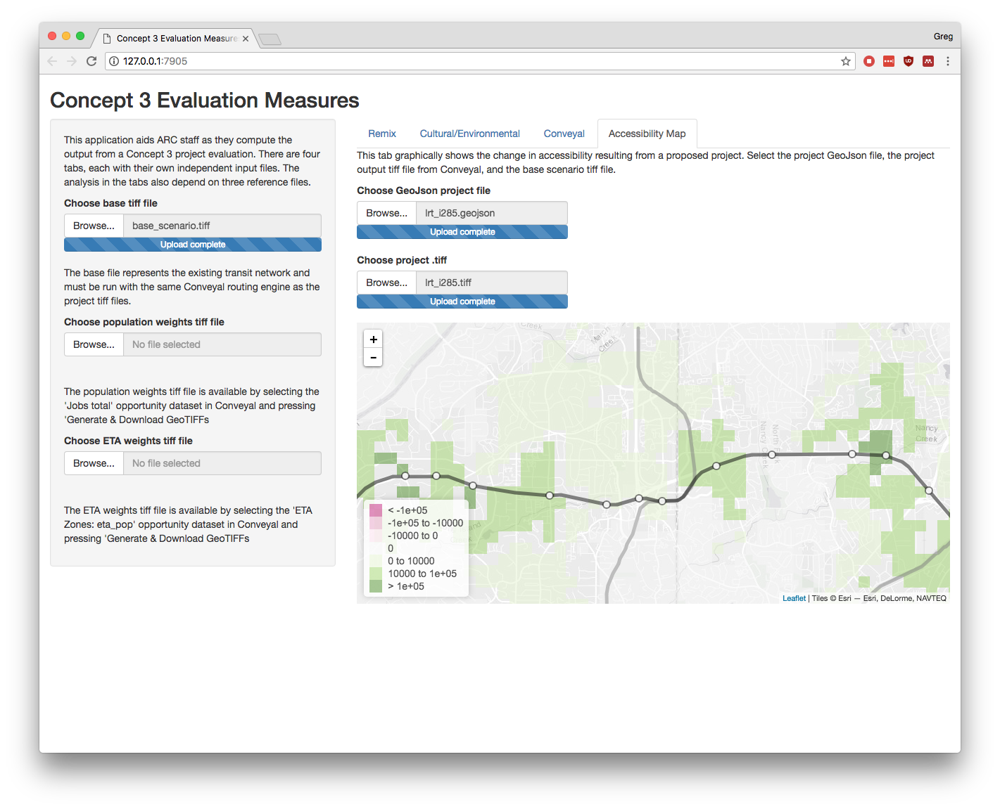

<!-- README.md is generated from README.Rmd. Please edit that file -->

# tvmeasures

The goal of tvmeasures is to aid ARC staff and their consultants in
generating project evaluation reports for transit projects under the
Concept 3 / Transit Vision program. It contains functions and libraries
to post-process outputs from the third-party tools Remix and Conveyal,
along with ARC’s own GIS-based cultural and environmental sensitivity
calculator.

## Installation

You can install tvmeasures from github with:

``` r
# install.packages("devtools")
devtools::install_github("transportfoundry/tvmeasures")
```

## Example

To use the functions in tvmeasures, you need to load the library.

``` r
library(tvmeasures)
```

There is a Shiny application that will aid non-programmers in using
these functions for multiple projects. Start the application with the
following command:

``` r
run_evaluation_app()
```

The app will open in Chrome, and it contains its own documentation.



The library contains functions to compute the percentile and summed
accessibility contained in project tiff files written out by
Conveyal.

``` r
base <- read_tiff(system.file("extdata/base_am_jobs.tiff", package = "tvmeasures"))
pop  <- read_tiff(system.file("extdata/pop_total_4326.tiff", package = "tvmeasures"))
beltline <- read_tiff(system.file("extdata/beltline_am_jobs.tiff", package = "tvmeasures"))

# percentile accessibility
compute_pctaccess(beltline, pop, probs = c(0.7, 0.9))
#>   70%   90% 
#>  4324 30624

# percent difference between project and base
(sum_access(beltline) - sum_access(base)) / sum_access(base) * 100
#> [1] 0.2049587
```
