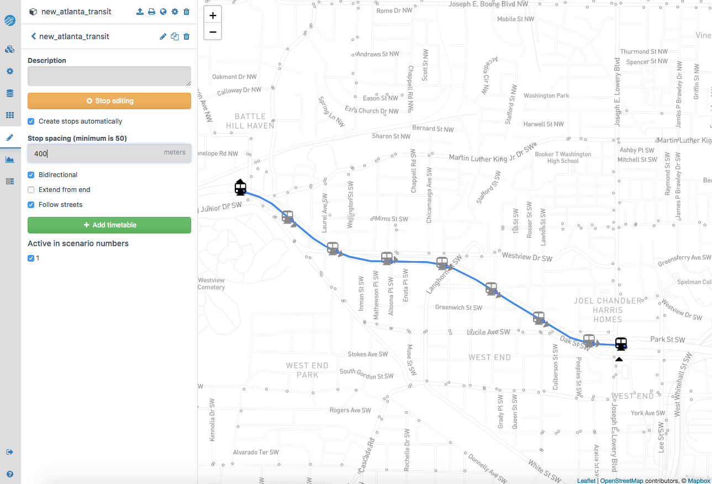
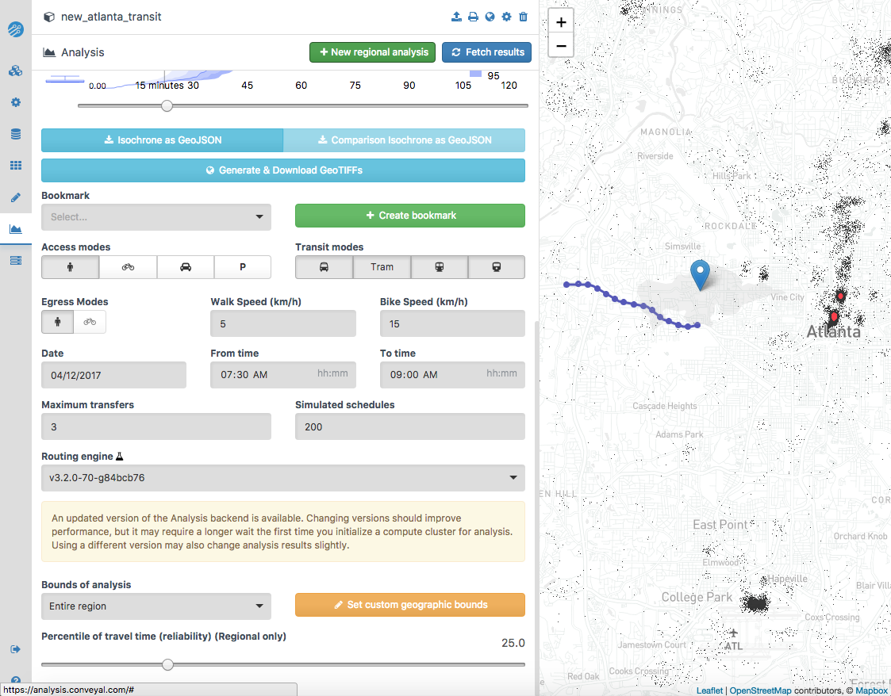
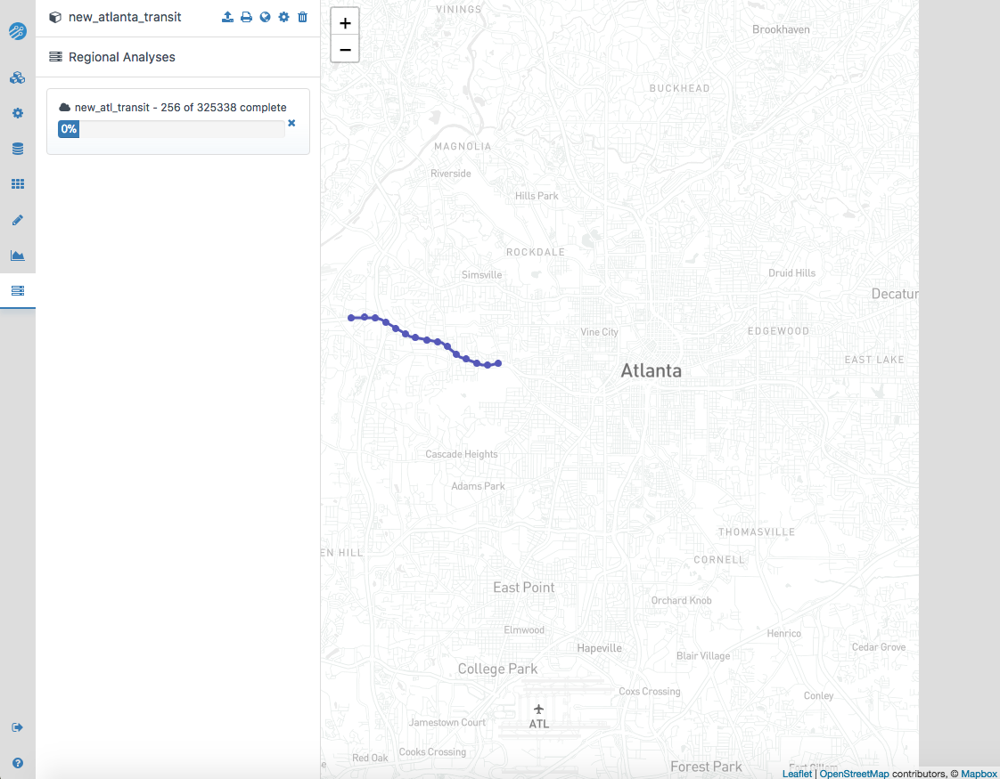
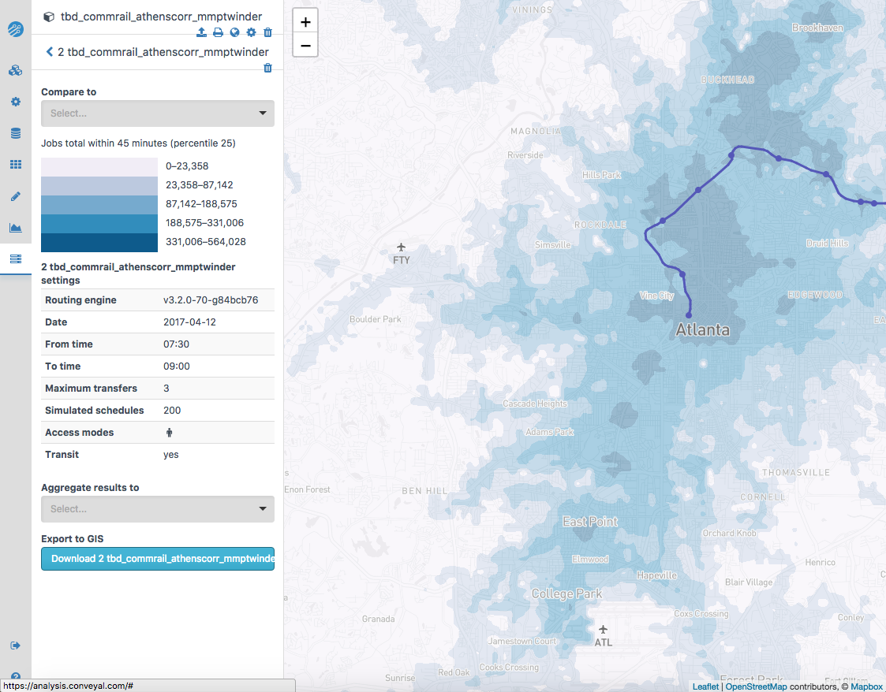

Conveyal Analysis provides a number of ways to measure employment accessibility,
depending on the level of service, target populations, and type of jobs. We use
each of the following measures to get more wide ranging view of a project’s
expected impact on job access:

  - *POP Access*: Increase in the number of jobs within 45 minutes by transit from all points in the region. Each point is weighted by the total population in the region.
  - *POP 70*: Jobs accessible via transit by the 70th percentile grid cell, weighted by total population. An indicator of expanding transit to areas with little to know service.
  - *POP 90*: Jobs accessible via transit by the 90th percentile grid cell, weighted by total population. An indicator of expanding the number of areas with excellent service.
  - *EQ Access*: Increase in the number of jobs within 45 minutes by transit from all points in the region. Each point is weighted by low-income and non-white population.
  - *EQ 70*: Jobs accessible via transit by the 70th percentile grid cell, weighted by low-income and non-white population. An indicator of expanding transit to areas with little to know service.
  - *EQ 90*: Jobs accessible via transit by the 90th percentile grid cell, weighted by low-income and non-white population. An indicator of expanding the number of areas with excellent service.

## Coding projects in Conveyal

As with the Remix page, this is not intended to be a comprehensive training
document for using Conveyal, but rather how to apply the specific Concept 3
analyses.

To add a new project to your region, click "Create new project" from the top of
the left-hand toolbar. You will be prompted to name the project, as well as to
select or create a GTFS bundle. The GTFS bundle used in the Concept 3 evaluations
is already available, and is named `issue-1033-3-merged-atlantaregion-ga-us`;
this bundle contains all Atlanta region transit operations as of April 2017.

### Stops and Routes
Conveyal renders stops based upon a set spacing for the entire project. Stop
creation/deletion can also be performed manually. To enable automatic stop
creation, toggle "Create stops automatically" in the editing menu, after which
you will be prompted to set a uniform distance. It is important to remember that
Conveyal reads distance in meters.

It is important to understand that Conveyal calculates modes of access entirely
on network. As such, when locating stops, you should consider what measures of
access you are attempting to maintain. For example, services whose stops do not
have access (i.e. are in the middle of the freeway or other non-pedestrian
friendly areas) may have future infrastructure to accommodate access needs;
Conveyal's usage of current network distance alone prevents the software from
taking this into account, potentially leading to discrepancies between the
software-based conception of the project and what the realization of it may be.

### Timetables

To edit the timetable, select "Add timetable" in the left-hand toolbar. In the
timetable menu, you will be able to assign a name to the timetable. The
Concept 3 project evaluation bases its Conveyal-derived metrics on an AM peak
period timetable, so the timetable must cover this period.

The dwell times, speed, and frequency are mode-specific. Speed can be set either
as an average for the entire route or by segment. This allows for different
speeds on surface streets and on expressways, for example. Once you have
configured all of your settings and ensured that the operations of the route are
clearly and accurately reflected in the software, you can move on to perform
analyses on the project.

### Regional Analysis

In order to begin analysis of the route you have created, select the "Analyze"
tab, which appears as a button pictured by a line graph on the left-hand
toolbar. The resulting screen will take a few seconds to a minute to render, but
it should include your route with a blue pin somewhere on the screen.
The blue pin, when placed along the route, will act as an individual departing
from the location where it is placed. The resulting blue isochrone is reflective
of the jobs that can be accessed within a certain time period. Before taking the
time to conduct analysis, it is advisable to test the route for errors in
direction, speed, etc. by placing the blue pin at various points along the line.

The Concept 3 project evaluation uses the settings described below and pictured
in the corresponding illustration:

  - Opportunity Dataset: `lodes-data-2014: Jobs total`
  - Time threshold: 45 minutes
  - Access modes: walk
  - Transit modes: bus, tram, subway, rail
  - Egress modes: walk
  - Walk speed: 5 km/h
  - Bike speed: 15 km/h (inapplicable)
  - Date: 04/12/2017
  - From time: 07:30 AM
  - To time: 09:00 AM
  - Maximum transfers: 3
  - Simulated schedules: 200

The Concept 3 projects were evaluated with the `v3.2.0-70-g84bcb76` experimental
routing engine. It is our understanding that Conveyal intends to deprecate this
engine. It is not appropriate to compare analyses conducted with
different engines.

In order to set off the analysis of the project, click "New regional analysis"
at the top of the analysis menu. You will be prompted to name the analysis,
after which the analysis will take a few hours to compute. The analysis will be
visible in the "Regional Analysis" tab on the left-hand toolbar.

When the analysis is complete, the resulting heatmap can be exported as a `.tiff`
image file. This becomes the input to the application on this tab.

