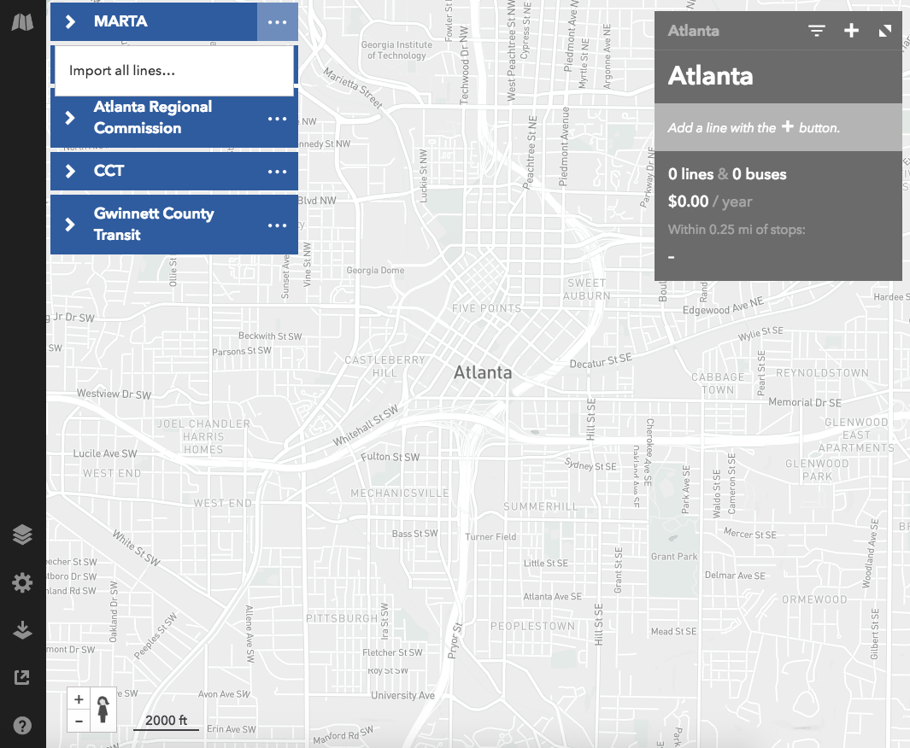
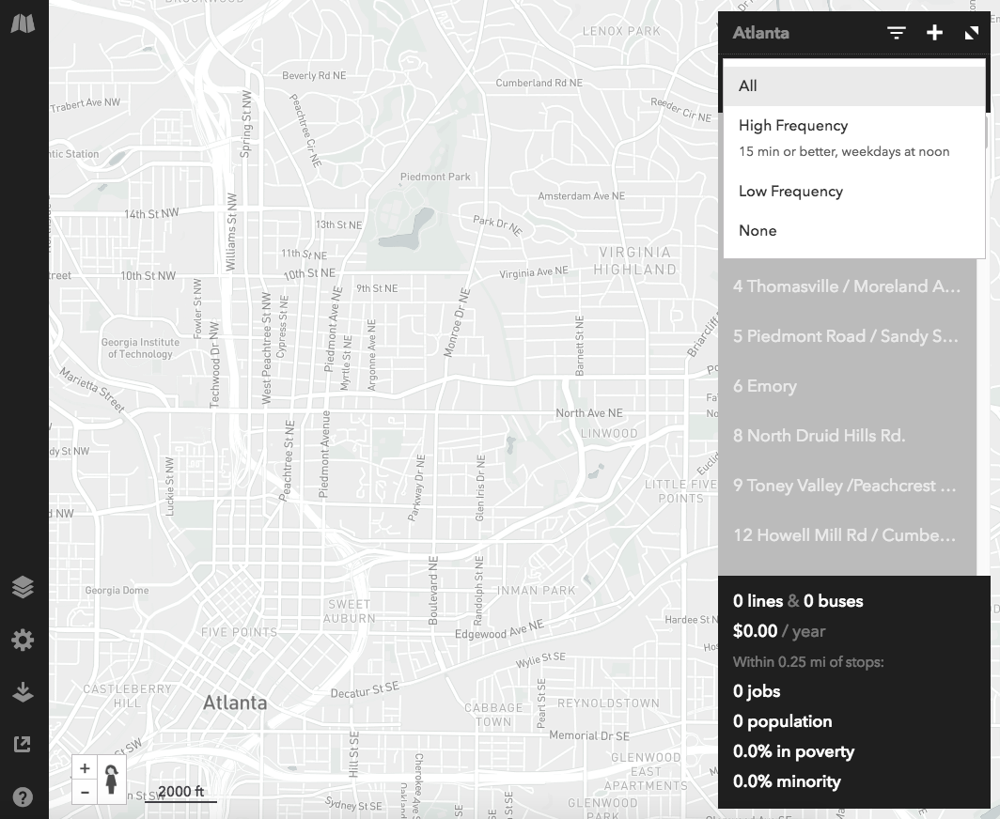

#### Definitions

*Efficiency* Jobs and population within a half-mile of station areas divided by
weekday service miles. A higher number indicates more efficient service. Riders
per service mile is a common measure of organizational sustainability for
transit operators in that it balances a measure of the capital and operating
costs of a project against the project’s effectiveness in delivering service.
Within the RTV this measure is estimated from a project’s job and household
totals within a 1⁄2 mile catchment area divided by service miles as determined
by Remix.

*Compatibility* Ratio of jobs and population near the service area. A number
closer to 1 indicates a balance in land use and likely reduction in transfers.
This criterion considers the balance between jobs and population. The
job/population balance is defined as the smaller number of people or jobs
within a 1⁄2 mile catchment divided by the larger number. This provides an
elementary assessment of the land use mix along the corridor with more diverse
corridors measuring closer to 1. The number of jobs and people in the catchment
areas are taken from Remix.

*Social Equity* Population within 1⁄2 mile who are non-white, or are under the
poverty line (whichever is greater). We take from Remix the greater of either 1)
the percent of people with an income under the poverty line within a 1⁄2 mile of
project stations or 2) the percent of the non-white population within a 1⁄2 mile
of project stations. A larger number implies more support for disadvantaged
communities.

## Coding Projects in Remix

This section describes how to code projects in Remix and extract information
for the Concept 3 project evaluation. Complete directions on coding transit
services in Remix is beyond the scope of this manual. Rather, we will focus on
the elements necessary for the project evaluation.

### Base Map

The measures obtained from Remix are station-area measures of proximity to
employment and housing. Importing the existing transit network is not necessary
for these metrics, but can be helpful in drawing or counting connections to
existing transit services.

To begin adding existing service providers to the network, simply click the
ellipsis to the right of the desired provider(s) and select "Import all
lines..." The import may take a few seconds, after which the ellipsis will
convert to a check to notify you that the upload is complete.

All of the agency services will now appear in the right-hand toolbar, and can be
selected and de-selected as a group, or based other attributes such as their
frequency. Remix considers considers transit services "high frequency" if they
have weekday mid-day headways of 15 minutes or less. Connections with such
services are part of the project evaluation, and this tool can be useful for
collecting this information.

### Coding Services

The route and station locations are project-specific; note that Remix will
automatically create stops where the line crosses over pre-existing stops. After
the line has been created, these stops can be turned off by simply clicking on
them or deleted entirely by right-clicking and selecting "Delete Stop".
When the entire line has been finished, you can employ Remix's automated stop
creation tool to create stops or add/enable stops manually along the route. That
tool is housed in the ellipsis at the top of the right-hand toolbar.

The speed and headways for the project are mode specific and are set in the
expanded timetable view below.

Remix provides data from the American Community Survey (ACS) and the
Longitudinal Employer-Household Dynamics (LEHD) dataset, bounded by radial
distances around transit stop locations that are set by the user. You can edit
the distance by clicking on it in the bottom of the right-hand toolbar. Simply
type the distance in miles and the data will update for the area rendered. The
Concept 3 project evaluation meaures use *0.5 miles*.

The basic data on service characteristics and station area catchment areas are
shown at the bottom of the right-hand toolbar. The Concept 3 evaluation requires
weekday service miles, jobs, population, percent in poverty, and percent
minority population. If these are not immediately visible, you can expand the
selection to include other relevant data by simply expanding the right-hand
toolbar window OR alternately, you can select the data table and select the
information you would like to be included individually.

As the data cannot be exported in a table format, any databasing on a
project-by-project basis must be done manually. To ease working with this
application, store the information in a spreadsheet with the column names
described at the top of this page.
